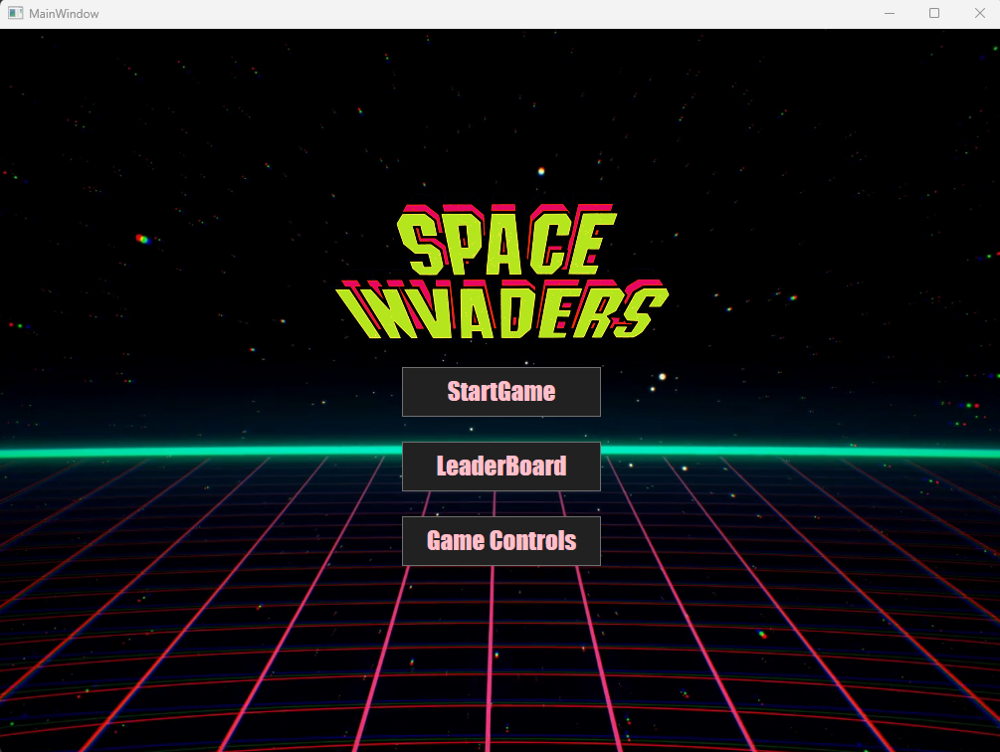
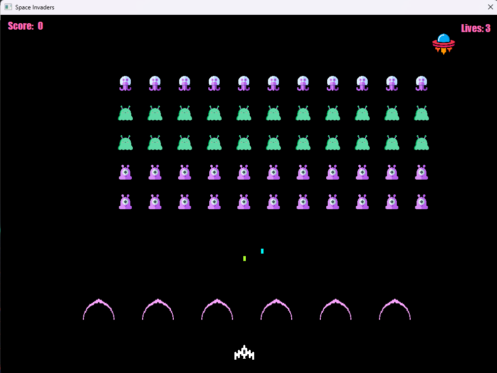
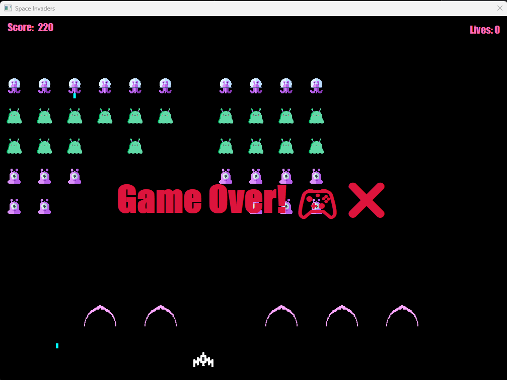
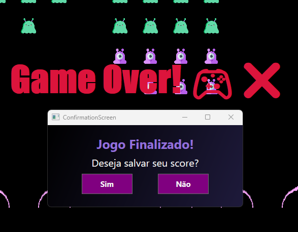
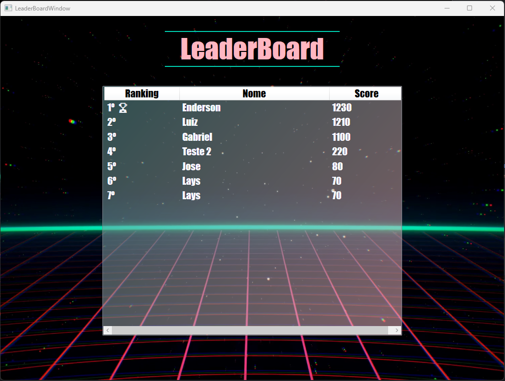
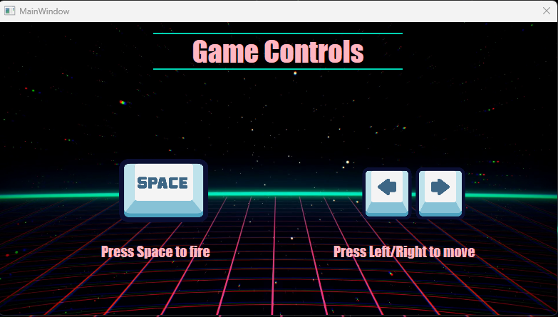
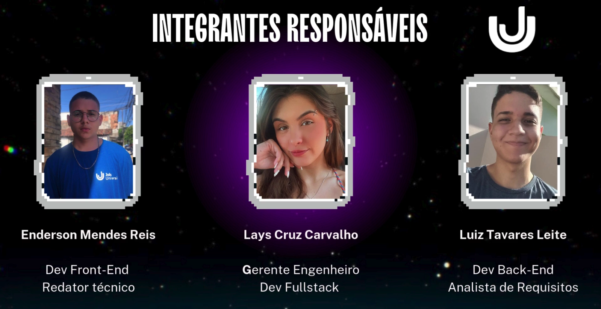

# 🚀 Space Invaders - Lays Carvalho 🛸

Bem-vindo ao **Space Invaders**, uma recriação moderna do clássico jogo Space Invaders, desenvolvido em **C#** como um projeto desktop.

---

## 🎮 Sobre o Jogo

No **Space Invaders**, você controla uma nave espacial para derrotar ondas de inimigos alienígenas. O objetivo é acumular o máximo de pontos enquanto sobrevive às investidas dos adversários. Conforme avança, a dificuldade aumenta, tornando o jogo cada vez mais desafiador.


## 🖼️ Imagens do Jogo

*Tela inicial*

 


*Game*




*Fim do jogo*






*Ranking*



---

## 🛠️ Funcionalidades 

### Implementadas

- **Movimentação do Jogador**: 

    - 
    - O jogador se move para a esquerda e direita usando as setas do teclado (← e →).
    - O jogador atira projéteis pressionando a barra de espaço.


- **Ataque Alienígena**: 

    - As naves alienígenas são destruídas ao serem atingidas pelos projéteis do jogador.
    - Cada nave destruída adiciona pontos à pontuação do jogador.


-  **Sistema de Pontuação**:

    -  : 10 pontos
    -  : 20 pontos 
    -  : 40 pontos  

    - O jogo termina ao atingir ***500 pontos***.


- **Blocos de Proteção**: 

    - 
    
    - O bloco de proteção (escudo) pode ser destruído pelo jogador.

    - O escudo suporta até 5 tiros antes de ser completamente destruído.


- **Tela Inicial**: 
    - Opção para iniciar um novo jogo.
    - Instruções sobre os controles (movimentação e disparo).
    - Quadro de Líderes (melhores pontuações)


- **Naves "mãe"**: 
    - 
    - Naves alienígenas vermelhas que se movem aleatoriamente (esquerda/direita) e saem do quadro.
    - Elas aparecem 1 vez a cada 2 minutos e concedem pontos variados ao serem destruídas.


- **Termino do Jogo** 
     O jogo termina quando:
    - O jogador perde todas as vidas.
    - As naves alienígenas alcançam o jogador.


- **Blocos de Proteção**: 
    - Há 4 blocos de proteção que podem ser destruídos conforme recebem dano.


- **Movimentação das Naves Alienígenas**: 
    - As naves se movem da esquerda para a direita e descem uma posição ao atingir a borda.
    - A velocidade do movimento e dos disparos aumenta a cada onda.


- **Sistema de Vidas**: 
    - A cada 1000 pontos, o jogador ganha uma vida extra (máximo de 6 vidas).


- **Finalização**: O jogo termina quando o jogador perde todas as vidas ou os alienígenas alcançam sua nave.

---


## 🖥️ Requisitos do Sistema

- **Sistema Operacional**: Windows, macOS ou Linux.
- **Dependências**: .NET Framework ou .NET Core.

---

## 🚀 Como Jogar

1. **Iniciar**: Selecione "Start Game" no menu principal
2. **Comandos**:
   - **Setas Esquerda/Direita**: Controle o movimento da nave.
   - **Barra de Espaço**: Atira nos inimigos.

*Como jogar*



3. **Missão**: Eliminar todos os inimigos antes que invadam sua nave ou cheguem até você.
4. **Desempenho**: Registre sua pontuação ao final e tente superar seus próprios recordes.

---

## ▶️ Como Executar o Projeto Localmente

### Pré-requisitos
- Sistema Operacional: Windows
- .NET SDK 6.0 ou superior
- Visual Studio 2022 ou JetBrains Rider

### Passos para executar
1. Clone o repositório:
```
git clone https://github.com/lays-carvalho/Space-Invaders.git
```

2. Acesse a pasta do projeto:
```
cd Space-Invaders
```

3. Abra o arquivo:
```
SpaceInvadersEP.sln
```

4. Se necessário, defina o projeto **SpaceInvadersEP** como projeto inicial para habilitar o botão **Run**.


5. Execute com:

- ▶️ **Run** no Rider

- ou **F5** no Visual Studio

🎮 O jogo será iniciado em uma janela desktop.


## 🗂️ Estrutura do Projeto

O projeto está organizado da seguinte forma:

- **SpaceInvadersEP/**
  - **Enemi/** (Gerencia os inimigos do jogo)
    - `Alien.cs` - Classe base para os alienígenas.
    - `AlienType1.cs` - Implementação do primeiro tipo de alienígena.
    - `AlienType2.cs` - Implementação do segundo tipo de alienígena.
    - `AlienType3.cs` - Implementação do terceiro tipo de alienígena.
  - **Game/** (Elementos principais do jogo)
    - `Bullet.cs` - Gerenciamento dos projéteis disparados.
    - `Shield.cs` - Implementação do escudo de defesa.
  - **Images/** (Armazena as imagens utilizadas no jogo)
    - **Main Images/** (Sprites do jogo)
      - `alien 1.png` - Imagem do primeiro tipo de alienígena.
      - `alien 2.png` - Imagem do segundo tipo de alienígena.
      - `alien 3.png` - Imagem do terceiro tipo de alienígena.
      - `player.png` - Imagem do jogador.
      - `shield1.png` - Imagem do escudo.
      - `backgroundInicial.png` - Imagem do fundo inicial do jogo.
      - `title.png` - Imagem do título do jogo.
  - **Player/** (Gerencia o jogador)
    - `Player.cs` - Classe do jogador e suas interações.
  - **ScoreGame/** (Gerencia a pontuação do jogo)
    - `CounterModel.cs` - Modelo de contagem de pontuação.
    - `CounterViewModel.cs` - ViewModel para exibição da pontuação.
  - `App.xaml` - Configuração inicial da aplicação.
  - `AssemblyInfo.cs` - Informações do projeto.
  - **Janelas da Interface Gráfica**
    - `GameControlsWindow.xaml` - Janela com controles do jogo.
    - `GameWindow.xaml` - Janela principal do jogo.
    - `LeaderBoardWindow.xaml` - Janela do placar de líderes.
    - `MainWindow.xaml` - Janela inicial do jogo.
  - **Code-behind das janelas**
    - `GameWindow.xaml.cs` - Lógica da janela principal do jogo.
    - `LeaderBoardWindow.xaml.cs` - Lógica da janela de placar.
    - `MainWindow.xaml.cs` - Lógica da janela inicial.

## Estrutura Mermaid


---

## 👥 Team

 


## 🚀 Demo

O vídeo da apresentação está disponível em:
👉 https://www.youtube.com/watch?v=d5-i3XkwyEo


## ⬇️ Download do Jogo (Windows)

O download da aplicação está disponível em:
👉 https://github.com/lays-carvalho/Space-Invaders/releases/tag/v1.0.0

- Baixar `.exe`: `SpaceInvaders-v1.0-win64.zip`

Basta baixar, extrair o `.zip` e executar o arquivo `.exe`.


## Contato

- 📧 Email: lays.carvalho.dev@gmail.com


- 💼 LinkedIn: https://www.linkedin.com/in/lays-cruz-carvalho/


- 💻 GitHub: https://github.com/lays-carvalho

